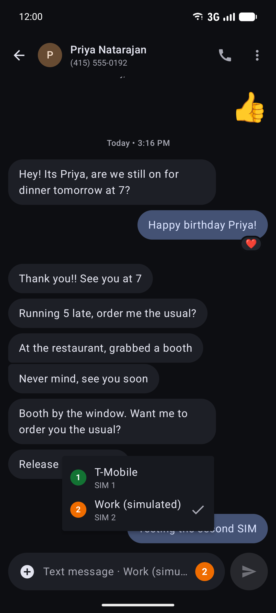
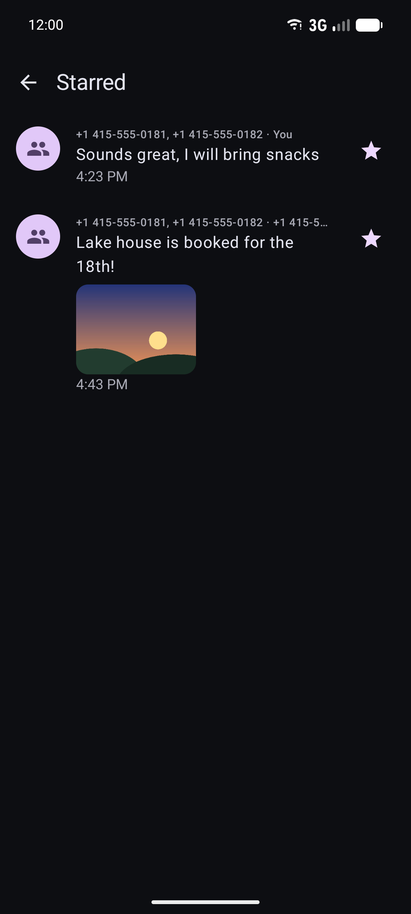
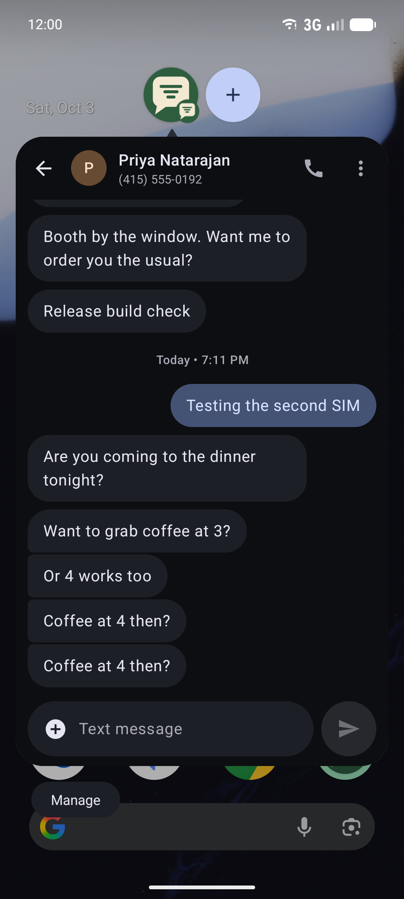
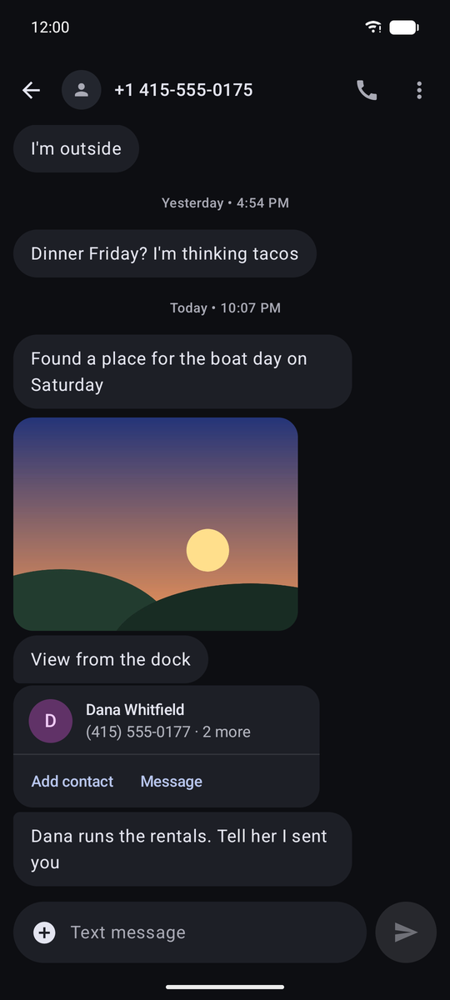
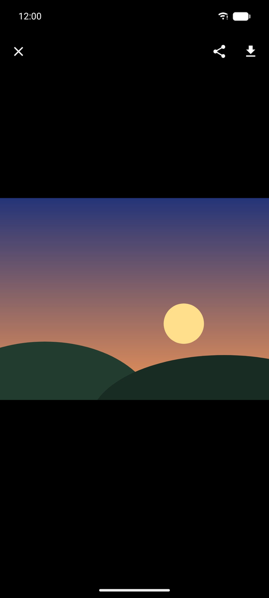
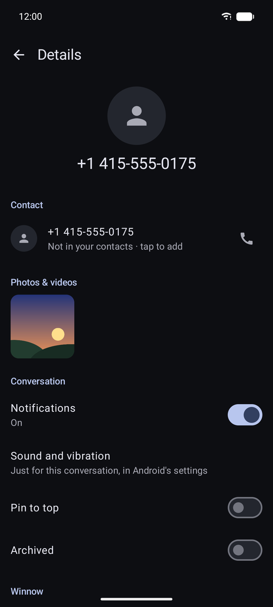
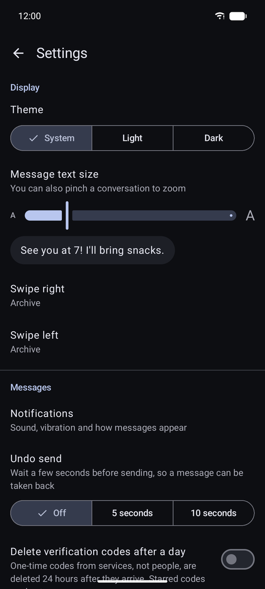

# Winnow

**An Android SMS/MMS app that reads every incoming text before it can buzz your phone.**
Messages from people come through. Phishing, scams, spam and political blasts go to
Filtered, with no notification. Marketing arrives quietly. Nothing is deleted, and one tap
fixes a wrong call.

<table>
  <tr>
    <td></td>
    <td></td>
    <td></td>
    <td></td>
  </tr>
  <tr>
    <td align="center"><sub>Inbox</sub></td>
    <td align="center"><sub>Filtered (spam &amp; blocked)</sub></td>
    <td align="center"><sub>Why it was filtered, with links disabled</sub></td>
    <td align="center"><sub>Group MMS, photos, reactions</sub></td>
  </tr>
</table>

Google Messages lets too much through. Winnow is a full replacement: it becomes your
default SMS app, so it sees each text first and decides whether it deserves your attention.
The decision comes from a pluggable classifier. Jev by TypeSafe is the first supported
provider, but Winnow depends only on a small decision interface. You can switch to another
service, your own server, any OpenAI-compatible model, or rules that run entirely on the
phone.

> Screenshots use Winnow's built-in sample conversations. Every name and number is fictional
> (555-01xx), and the "Classified by Jev" verdicts in them are part of that sample data.

## What it does

### Filtering that explains itself

Every incoming SMS and MMS gets one of seven categories: personal, transactional,
marketing, political, phishing, likely scam or spam. Each category maps to an action, which
you can change: **notify**, **silence** (inbox, no notification) or **filter** (Filtered,
no notification). A filtered conversation carries a banner saying what Winnow decided and
who decided it, with **Not spam**, **Filter sender** and **Report**. Report forwards the
text to your carrier's 7726 spam service, after you confirm. Links in phishing and scam
messages can't be tapped.

<table>
  <tr>
    <td></td>
    <td></td>
    <td></td>
    <td></td>
  </tr>
  <tr>
    <td align="center"><sub>Activity: what Winnow did</sub></td>
    <td align="center"><sub>Try it, and see exactly what leaves the phone</sub></td>
    <td align="center"><sub>Per-sender decisions, block, mute</sub></td>
    <td align="center"><sub>Menu</sub></td>
  </tr>
</table>

### A complete messaging app

- **SMS and MMS:** group conversations threaded correctly, photos in and out (downscaled to
  carrier limits) and a full-screen viewer (swipe through a conversation's photos, pinch or
  double-tap to zoom), and voice messages and videos that play right in the conversation.
  GIFs and animated stickers move (they hold still when Android's "Remove animations" is on).
  Any attachment can be saved to the phone or shared to another app. **Link previews**
  (off by default) show a link's title and picture, but only for your own links and texts
  from people in your contacts or that you've texted. Strangers and filtered texts never
  make Winnow fetch anything. Shared contacts show as cards with **Add contact** and **Message**, and
  Attach → Contact sends one (its photo left out, so it fits). Attach → **Voice message**
  records one (AAC, stopping at 5 minutes or 800 KB, so it always fits an MMS), and
  **Location** puts a map link for where you are into the draft (one fix, nothing tracked).
  GIFs and stickers sent from the keyboard (Gboard's GIF panel, for one) attach as pictures.
  Attach → **Video** records one with the camera. A video too big for an MMS is re-encoded to
  fit (144–360 lines, 10–15 fps), and a long one is cut to the part that fits, with a note
  saying so. iPhone tapbacks and SMS reactions are drawn on
  the message they react to. Failed sends and MMS downloads can be retried. SMS delivery
  reports are opt-in, and MMS auto-download can be turned off (it's off while roaming unless
  you allow it), leaving "Tap to download" in the conversation. Optionally, photos and videos
  that reach the inbox are saved to the phone's gallery (Pictures/Winnow, Movies/Winnow) as they arrive;
  filtered and silenced texts' never are.
- **Conversations:** pin, archive, mute (for an hour, 8 hours, a day, or until you turn it
  back on), mark read/unread, delete, block (Android's system
  block list), name a group (just for you), **Add people** (a new group with everyone in it plus whoever you add), a **Photos & videos** strip in Details, **Export** to a text file, an **Unread** filter (plus **Personal**, **Updates** and **Offers**, from what the classifier made of each conversation), and multi-select (in Filtered and Archived too, to rescue or clear several at once).
  Optionally, one-time codes from services are deleted a day after they arrive. That's off by
  default, never applies to texts from people, and keeps starred codes. Swipe to archive in the inbox (or set each direction to delete,
  mark read/unread, pin, or nothing), to mark not spam in Filtered, or to unarchive in
  Archived. Archiving and "not spam" can be undone, and deleting asks first. A deleted conversation waits
  in **Recently deleted** (in the menu) for 30 days, photos and Winnow's decisions included, and
  can be restored from there. Opening a conversation marks where its **new messages** begin. Full-text search covers SMS and MMS, and each conversation can be searched on its own,
  with matches highlighted; a search result opens its conversation at that message, and so
  does a starred one. Settings links to Android's blocked-numbers list.
- **Composing:** New chat with your contacts and Create group, photos from the gallery or the
  camera, drafts that stick (attachments included, even after Android closes the app), an SMS segment counter, **scheduled send** (long-press Send; the menu lists everything scheduled, and each can be sent now, moved to another time, edited or deleted), **send
  separately** in a group (each person gets their own text, so replies come back one to one), and
  optional **undo send** (5 or 10 seconds to take a message back). **Quick replies** ("On my
  way", "Can't talk now, I'll call you later", your own) sit in the + menu and appear as one-tap
  answers on notifications. Conversations you text with
  show up by name in Android's share sheet and on the app icon's long-press menu; sharing to
  one puts the photo or text straight into it. A text that doesn't go out
  (no signal, a carrier refusal, a scheduled one that fails) says so in a notification, and a
  message that fails after you've left its conversation is waiting in the composer when you
  come back.
- **Dual SIM:** on a phone with two SIMs, a badge in the composer shows which one a text
  goes out on, and tapping it switches. Each conversation remembers its SIM. Otherwise it
  uses the SIM their last text arrived on, then your default. Replies from notifications and
  scheduled texts use the same SIM, and message details say which SIM a text came in on.
- **Messages:** react (❤️ 👍 👎 😂 ‼️ ❓), copy (all or just part, with Select text),
  forward, share, star, delete, details, and "Copy code" for verification codes. **Select** several to copy, star or delete them together. Reactions go out as `Loved “…”`, which iPhones show as a
  tapback. **Starred** (in the menu) collects starred messages from every conversation, photos
  included.
- **Share to Winnow:** text, photos, videos and contacts shared from any app open New chat
  with them attached.
- **Notifications:** Android conversation notifications (Conversations section, priority),
  with a sound and vibration of their own per conversation (Details → Sound and vibration),
  stacked per thread, with inline **Reply**, **Mark as read**, **Copy code**, and **Spam** on a
  stranger's text that got through (it filters the sender and teaches the on-phone model), and **chat
  bubbles** that float a conversation over other apps. In **Android Auto** the same
  notifications are read aloud and answered by voice. A sideloaded build needs "Unknown
  sources" turned on in Android Auto's developer settings.
- **Backup and restore:** messages, photos, Winnow's decisions, conversation state, sender
  rules and settings go into one zip file that you choose where to keep. API keys are never
  included. Restoring onto a new phone, or the same one, only adds what's missing, so
  restoring twice is harmless. A new phone can restore right from onboarding. **Back up
  automatically** writes one every week while the phone charges, into a folder you pick
  once, such as one your cloud drive syncs. It keeps the newest four. Coming from another
  app? **Import from SMS Backup & Restore** reads that app's .xml backup, texts and picture
  messages included, and adds whatever isn't on the phone yet. Leaving? **Export for other
  apps** writes the same format, which most texting apps can import.
- **Big screens:** on a tablet, an unfolded foldable or a big window, the conversation list
  and the open conversation sit side by side, and the open one rides out rotation and resizing
  (narrowed, it carries on full size). A phone on its side keeps one pane. **Enter sends**
  (optional) makes a keyboard's Enter send; Shift+Enter still starts a new line.
- **Display:** light, dark or the system theme, and a message text size. Pinch a
  conversation to zoom its text; it snaps back to normal near 100%.
- **Getting started:** onboarding explains the RCS trade-off before it asks to become your
  SMS app. Once Winnow is in charge, it can review older conversations for spam.

<table>
  <tr>
    <td></td>
    <td></td>
    <td></td>
    <td></td>
  </tr>
  <tr>
    <td align="center"><sub>Reply from the notification</sub></td>
    <td align="center"><sub>Schedule send</sub></td>
    <td align="center"><sub>New chat and groups</sub></td>
    <td align="center"><sub>Message actions</sub></td>
  </tr>
  <tr>
    <td></td>
    <td></td>
    <td></td>
    <td></td>
  </tr>
  <tr>
    <td align="center"><sub>Onboarding, with the RCS trade-off</sub></td>
    <td align="center"><sub>Choose a classifier</sub></td>
    <td align="center"><sub>Search messages</sub></td>
    <td align="center"><sub>Light theme</sub></td>
  </tr>
  <tr>
    <td></td>
    <td></td>
    <td></td>
    <td></td>
  </tr>
  <tr>
    <td align="center"><sub>Back up and restore</sub></td>
    <td align="center"><sub>Dual SIM: pick per conversation</sub></td>
    <td align="center"><sub>Starred messages</sub></td>
    <td align="center"><sub>Chat bubbles</sub></td>
  </tr>
  <tr>
    <td></td>
    <td></td>
    <td></td>
    <td></td>
  </tr>
  <tr>
    <td align="center"><sub>Contact cards: add or message</sub></td>
    <td align="center"><sub>Photos: swipe, zoom, save, share</sub></td>
    <td align="center"><sub>Photos &amp; videos, conversation sound</sub></td>
    <td align="center"><sub>Theme, text size, swipe actions</sub></td>
  </tr>
</table>

The UI follows Google Messages: a large-title inbox on a rounded sheet, an avatar menu,
timestamped conversation blocks, Material You colors and dark mode.

## Privacy

What a classifier service sees is deliberately small. Settings → **Try it** shows the exact
payload for any message.

- Texts from saved contacts, from people you've texted, and verification codes are decided
  on the phone and never sent anywhere.
- Runs of 4+ digits become `####`, email addresses become `[email]`, and links are sent as
  their domain only.
- The sender's number isn't shared unless you turn that on.
- **Zero-retention only** mode skips any provider you haven't marked as keeping no data.
- API keys are encrypted with the Android Keystore.
- **Lock Winnow** asks for your fingerprint, face or screen lock after a minute away, and
  blanks Winnow's card in recents. **Hide texts on the lock screen** keeps new-message
  notifications off it entirely. Even without that, a locked phone set to hide sensitive
  content shows only "New message".
- **On this phone only** keeps everything local. Winnow's own model (below) decides, and
  it only filters when it's at least 85% sure; otherwise it silences.
- **Decide on this phone when it's sure** keeps texts the model is very sure about (95%+)
  from ever reaching your provider. In cross-validation that's 65% of texts, and 98.2%
  of those calls are right.
- If no provider answers in time, the on-phone model decides. If classification fails
  altogether, the message is delivered with a notification.

## Classification is provider-agnostic

```
incoming text → local rules (contacts, codes, sender rules)
              → on-phone model, if you let it decide when it's sure
              → privacy gate + redaction
              → DecisionProvider: Jev (TypeSafe / OpenRouter) · any System One server
                                  · any OpenAI-compatible LLM
              → on-phone model if nothing answers
```

The app only depends on `DecisionProvider`: a state plus typed multiple-choice questions,
answered with probabilities. Jev speaks that shape natively. Anything else can implement it.
Details, including how to add a provider: [docs/ARCHITECTURE.md](docs/ARCHITECTURE.md).

### The on-phone model

Winnow ships its own classifier: a softmax regression over words, word pairs and signals
for what words miss. Those signals include a link to an unusual domain, a web address dressed
up as another ("sunpass.com-tollpay.vip"), a stranger introducing themselves "with" a group,
a donation "match", a deadline, a "reply STOP" opt-out, and letters from another alphabet
posing as English. The weights are 230 KB. It classifies a text in about 50 µs on a laptop
JVM (not yet measured on a phone), and it says why it decided ("Decided on this phone:
“confirm”, “package”, “fee”"). It's trained from 1,369 labeled texts in
`classifier/training/`, balanced across all seven categories.
`./gradlew :classifier:trainLocalModel` rebuilds it, and a test fails if the shipped model or
its metrics don't match the corpus.

A provider like Jev is still the better judge. The model's job is to keep the phone useful
without one.

## How accurate it is

**Filtered → How accurate is this?** opens the full report card, measured with 5-fold
cross-validation: every text is scored by a model that never saw it.

| Accuracy | Macro F1 | Cohen's κ | MCC | ROC AUC (unwanted vs. wanted) | Avg. precision | Calibration error |
|---|---|---|---|---|---|---|
| 91.7% | 0.92 | 0.90 | 0.90 | 0.989 | 0.988 | 0.010 |

Winnow's own filtering rule filters an unwanted category at ≥85% confidence. A scam or
phishing text only gets filtered if it has a hook: a link off the company's real site, money,
a number to call, or payment or code talk. Anything without one is silenced instead, because
a bare "hi, is this David?" reads exactly like a real person on a new number, and "your
password was changed" has nothing to phish with. Measured that way, the rule filters
**0.1% of wanted texts** (99.8% precision) and 70.8% of unwanted ones. Counting
filtered and silenced, **96.2% of unwanted texts never buzz your phone**. Per category,
F1 runs from 0.97 (political) to 0.79 for "likely scam", whose openers read like real new
numbers. On 120 more texts written separately and never trained on, it got all 120 right.

<table>
  <tr>
    <td></td>
    <td></td>
    <td></td>
    <td></td>
    <td></td>
  </tr>
  <tr>
    <td align="center"><sub>ROC AUC, κ, MCC, F1; the ROC curve (scrub it)</sub></td>
    <td align="center"><sub>Pick a threshold, see the outcomes</sub></td>
    <td align="center"><sub>Calibration: is “90% sure” right 90% of the time?</sub></td>
    <td align="center"><sub>Every category: precision, recall, F1, AUC</sub></td>
    <td align="center"><sub>Confusion matrix and coverage</sub></td>
  </tr>
</table>

The ROC and precision–recall curves follow your finger, and both move with the threshold
slider, which redraws caught, missed, wrongly flagged and let through, plus precision,
recall, F1, MCC and κ. The report also covers calibration (does "90% sure" mean right 90% of
the time?), each category's precision, recall, F1 and one-vs-rest AUC, the confusion matrix,
and how often you've corrected Winnow on your own texts. The same numbers are in
[classifier/training/REPORT.md](classifier/training/REPORT.md).

The test texts are hand-written to show their category clearly, so real traffic will score
lower. These figures are for the on-phone model. A classifier service like Jev shows up in
the "On your phone" agreement score, which comes from your corrections.

It also **learns from your corrections**. "Not spam" or "Filter sender" teaches it about
that message's content, so similar texts from other senders follow; a sender rule only
covers the one sender. Only hashed word fingerprints are kept, never the message, and
Settings → **Forget** undoes all of it.

## RCS

Android has no public RCS API: only Google Messages can use it. As your default SMS app,
Winnow sends and receives **SMS and MMS**. Group chats and photos work, but typing
indicators, read receipts and end-to-end encryption don't. Message transport sits behind
one interface, so RCS can be added if Google ever opens it. You can switch back to Google
Messages at any time.

## Build and run

You need JDK 17+ (21 recommended) and an Android SDK with API 37. The minimum supported
version is Android 12 (API 31).

```sh
export JAVA_HOME=~/.local/opt/jdk-21          # wherever your JDK lives
echo "sdk.dir=$HOME/Android/Sdk" > local.properties
./gradlew :classifier:test :mms:test :app:testDebugUnitTest   # JVM unit tests
./gradlew :app:assembleDebug                   # app/build/outputs/apk/debug/app-debug.apk
adb install -r app/build/outputs/apk/debug/app-debug.apk
```

Open Winnow, follow onboarding, and pick a classifier. Until a provider is configured,
Winnow runs on the phone only.

### Trying it on an emulator

```sh
scripts/emulator-smoke.sh
```

The smoke script installs the app, takes the SMS role, and feeds it sample traffic: SMS
through the emulator's virtual modem, a tapback, a group MMS with a photo, and an MMS whose
download fails. It refuses to run unless exactly one device is attached and that device is
an emulator. Every number is fictional and nothing leaves the machine.

You can also do it by hand. `adb emu sms send 4155550123 "hello"` delivers an SMS. Debug
builds accept fake MMS through the real receive path, since emulators have no MMS server:

```sh
adb shell am broadcast -n com.ericflo.winnow/.debug.DebugMmsReceiver \
    --es from +14155550181 --es to "+15551234567,+14155550182" --es text "hi" --ez photo true
```

`--ez voice true`, `--ez video true` and `--ez contact true` attach a voice memo, a clip or a
contact card instead of (or as well as) the photo.

`DebugSeedReceiver` writes thousands of synthetic messages, for testing at scale.

### Live classifier test (opt-in)

This runs the real pipeline against Jev and needs your own key. It never runs in CI.

```sh
WINNOW_LIVE_TESTS=1 ./gradlew :classifier:test --tests '*LiveProviderTest*' --rerun
```

It uses `OPENROUTER_API_KEY` and/or `TYPESAFE_API_KEY`.

## CI and releases

CI runs on [Woodpecker](https://woodpecker-ci.org/) from `.woodpecker.yml`. Every push to
`main` runs the full gate: unit tests for `:classifier`, `:mms` and `:app`, Android lint, and
a debug build. It runs in `eclipse-temurin:21-jdk` as an unprivileged user.
`scripts/ci/android-sdk.sh` installs the Android SDK (command-line tools pinned by checksum) and
the Gradle cache into the workspace. The same gate locally:

```sh
./gradlew :classifier:test :mms:test :app:testDebugUnitTest :app:lintDebug :app:assembleDebug
docker run --rm -v "$PWD":/repo -w /repo woodpeckerci/woodpecker-cli:v3.18.1 lint .woodpecker.yml
```

### Cutting a release

Push a tag named `vMAJOR.MINOR.PATCH`. A suffix, as in `v0.2.0-rc1`, makes it a pre-release.

```sh
git tag -a v0.2.0 -m "Winnow 0.2.0"
git push origin v0.2.0
```

The tag's pipeline runs the gate, then `scripts/ci/release.sh`, which:

- Builds `:app:assembleRelease` with versionName `0.2.0` from the tag. The versionCode is
  MAJOR×10000 + MINOR×100 + PATCH, so minor and patch stay under 100 and every release
  upgrades the last.
- Aligns and signs the APK with the release key.
- Attaches `winnow-0.2.0.apk` and its `.sha256` to the GitHub Release for the tag. The release
  is created with generated notes if it doesn't exist. Re-running the pipeline replaces the
  files.

### Woodpecker secrets

The release step needs five repository secrets. Limit each one to the `tag` event, so ordinary
pushes never see them.

| Secret | What it holds |
|---|---|
| `winnow_github_token` | A fine-grained GitHub token for `ericflo/winnow` only, with Contents: read and write. Creating releases and uploading assets needs nothing more. |
| `winnow_keystore_base64` | The release keystore, base64-encoded on one line |
| `winnow_keystore_password` | The keystore's password |
| `winnow_key_alias` | The signing key's alias |
| `winnow_key_password` | The signing key's password |

Make the keystore once, and keep it and both passwords somewhere safe. Android only installs
an update signed with the same key as the installed app.

```sh
keytool -genkeypair -v -keystore winnow-release.jks -alias winnow -keyalg RSA -keysize 4096 -validity 10000
```

Add the secrets in the repository's Woodpecker settings, or with the CLI. The keystore
password goes in the same way as the token:

```sh
woodpecker-cli repo secret add --repository ericflo/winnow --event tag \
  --name winnow_keystore_base64 --value "$(base64 -w0 winnow-release.jks)"
woodpecker-cli repo secret add --repository ericflo/winnow --event tag \
  --name winnow_github_token --value "$GITHUB_RELEASE_TOKEN"
```

## Project layout

```
classifier/   Pure Kotlin/JVM: decision interface, providers, taxonomy, privacy, redaction, tests.
mms/          Pure Kotlin/JVM: MMS PDU encoder/decoder (OMA-MMS-ENC over WSP), tests.
app/          The Android app: Compose + Material 3; Room for verdicts, conversation state and
              scheduled sends; DataStore for settings; the system SMS/MMS store for messages.
docs/         Architecture notes and screenshots.
scripts/      Emulator smoke test; ci/ holds the Woodpecker SDK setup and release scripts.
```

## Status

Developed and verified on the Android emulator, and not yet run on a phone. Not built:
RCS (see above). Emulators have one SIM, so the SIM picker was exercised with a debug-only
pretend second SIM (`DebugSimReceiver`) that sends through the real one. Sending on a real
second SIM is the platform's `SmsManager.createForSubscriptionId`, and it hasn't run yet.
