# Winnow

**An Android SMS/MMS app that reads every incoming text before it can buzz your phone.**
Messages from people come through. Phishing, scams, spam and political blasts go to
Filtered, with no notification. Marketing arrives quietly. Nothing is deleted, and one tap
fixes a wrong call.

<table>
  <tr>
    <td></td>
    <td>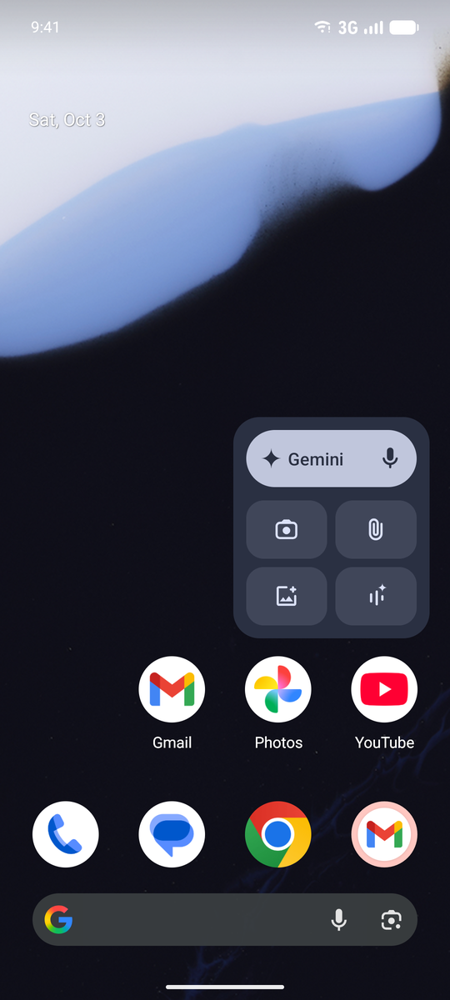</td>
    <td>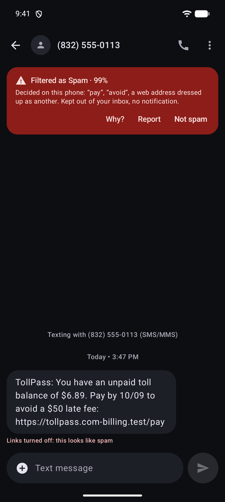</td>
    <td></td>
  </tr>
  <tr>
    <td align="center"><sub>Inbox</sub></td>
    <td align="center"><sub>Filtered (spam &amp; blocked)</sub></td>
    <td align="center"><sub>Why it was filtered, with links disabled</sub></td>
    <td align="center"><sub>Group MMS, photos, reactions</sub></td>
  </tr>
</table>

Google Messages lets too much through. Winnow is a full replacement: it becomes your
default SMS app, so it sees each text first and decides whether it deserves your attention.
The decision comes from a pluggable classifier. Jev by TypeSafe is the first supported
provider, but Winnow depends only on a small decision interface. You can switch to another
service, your own server, any OpenAI-compatible model, or rules that run entirely on the
phone.

> Screenshots use Winnow's built-in sample conversations. Every name and number is fictional
> (555-01xx), and the "Classified by Jev" verdicts in them are part of that sample data.

## What it does

### Filtering that explains itself

Every incoming SMS and MMS gets one of seven categories: personal, transactional,
marketing, political, phishing, likely scam or spam. Each category maps to an action, which
you can change: **notify**, **silence** (inbox, no notification) or **filter** (Filtered,
no notification). A filtered conversation carries a banner saying what Winnow decided and
who decided it, with **Not spam**, **Filter sender** and **Report**. Report forwards the
text to your carrier's 7726 spam service, after you confirm. Links in phishing and scam
messages can't be tapped.

<table>
  <tr>
    <td>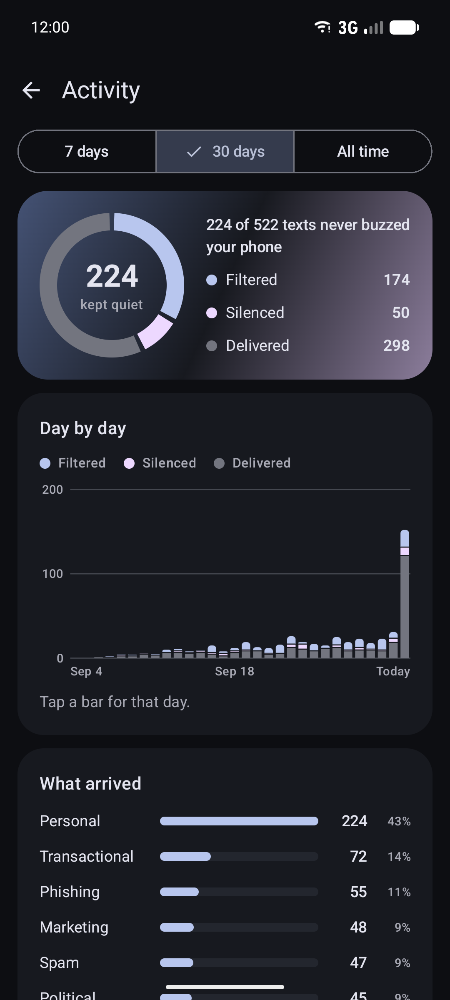</td>
    <td>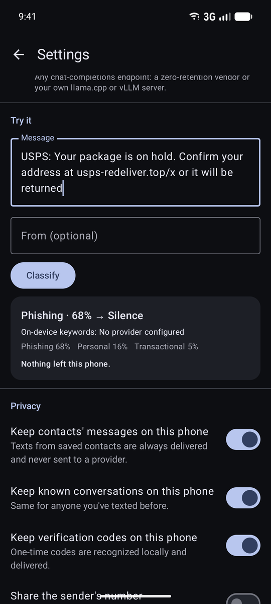</td>
    <td>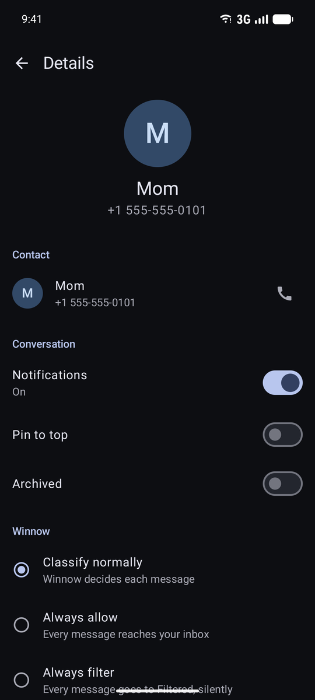</td>
    <td></td>
  </tr>
  <tr>
    <td align="center"><sub>Activity: what Winnow did</sub></td>
    <td align="center"><sub>Try it, and see exactly what leaves the phone</sub></td>
    <td align="center"><sub>Per-sender decisions, block, mute</sub></td>
    <td align="center"><sub>Menu</sub></td>
  </tr>
</table>

### A complete messaging app

- **SMS and MMS:** group conversations threaded correctly, photos in and out (downscaled to
  carrier limits), and a full-screen viewer. iPhone tapbacks and SMS reactions are drawn on
  the message they react to. Failed sends and MMS downloads can be retried. SMS delivery
  reports are opt-in.
- **Conversations:** pin, archive, mute, mark read/unread, delete, block (Android's system
  block list), and multi-select. Swipe to archive in the inbox, to mark not spam in Filtered,
  or to unarchive in Archived. Full-text search covers SMS and MMS.
- **Composing:** New chat with your contacts and Create group, drafts that stick, an SMS
  segment counter, and **scheduled send** (long-press Send).
- **Messages:** copy, forward, delete, details, and "Copy code" for verification codes.
- **Notifications:** Android conversation notifications (Conversations section, priority),
  stacked per thread, with inline **Reply**, **Mark as read** and **Copy code**.
- **Backup and restore:** messages, photos, Winnow's decisions, conversation state, sender
  rules and settings go into one zip file that you choose where to keep. API keys are never
  included. Restoring onto a new phone, or the same one, only adds what's missing, so
  restoring twice is harmless.
- **Getting started:** onboarding explains the RCS trade-off before it asks to become your
  SMS app. Once Winnow is in charge, it can review older conversations for spam.

<table>
  <tr>
    <td>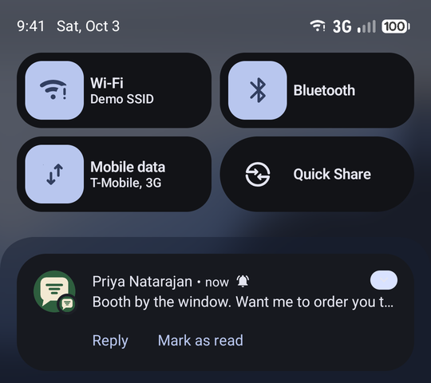</td>
    <td>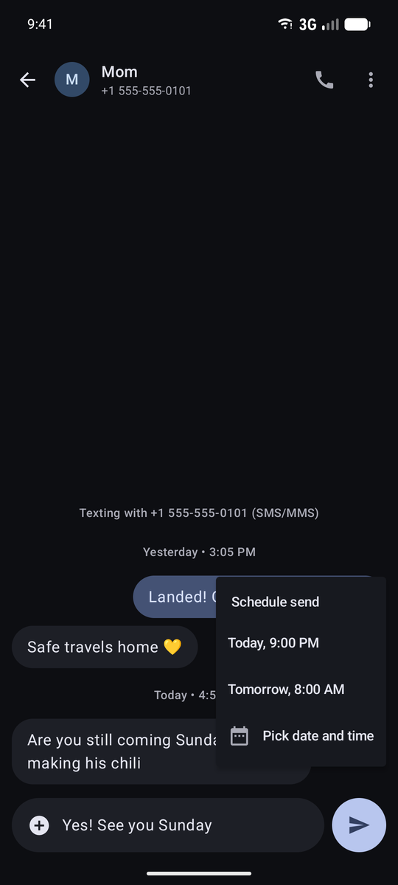</td>
    <td>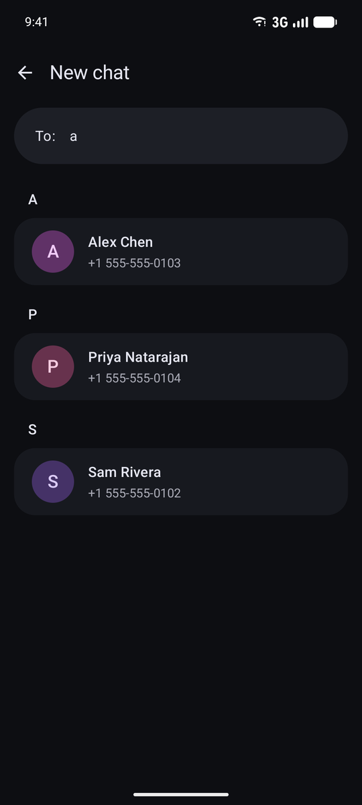</td>
    <td>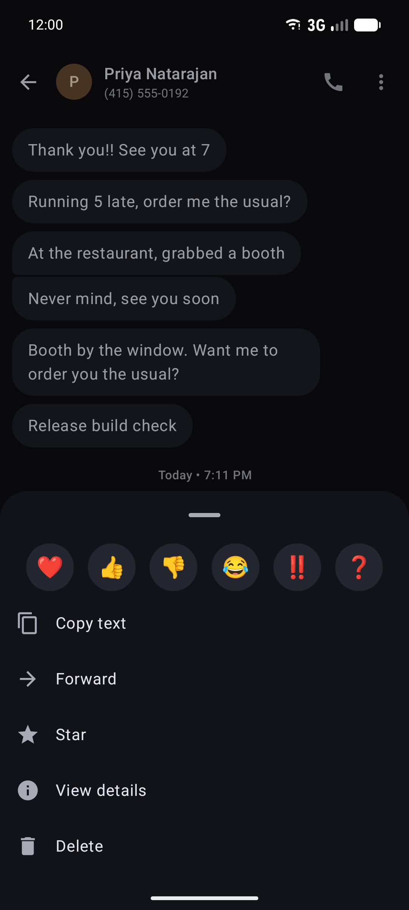</td>
  </tr>
  <tr>
    <td align="center"><sub>Reply from the notification</sub></td>
    <td align="center"><sub>Schedule send</sub></td>
    <td align="center"><sub>New chat and groups</sub></td>
    <td align="center"><sub>Message actions</sub></td>
  </tr>
  <tr>
    <td>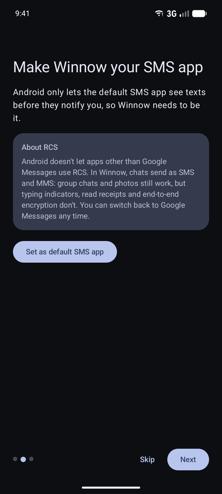</td>
    <td>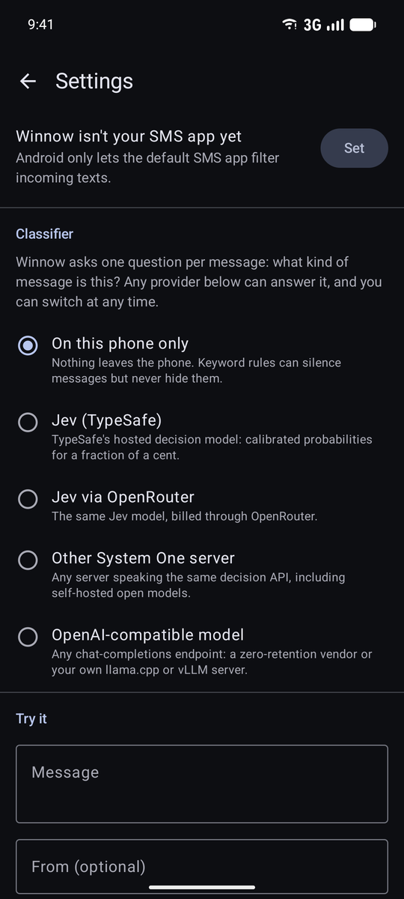</td>
    <td>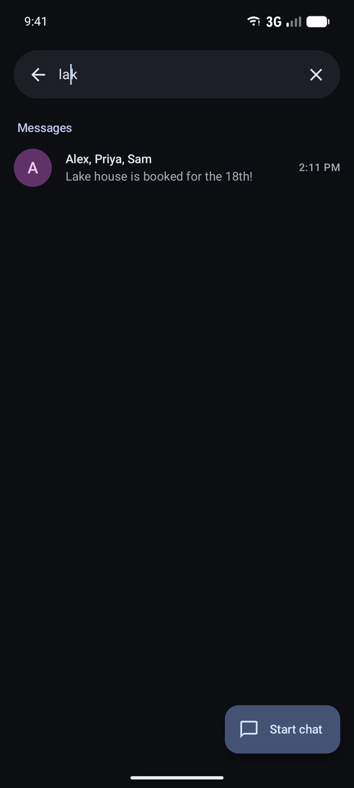</td>
    <td>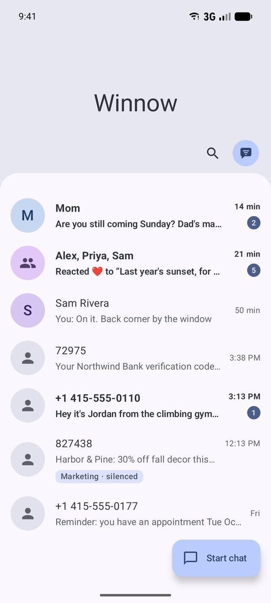</td>
  </tr>
  <tr>
    <td align="center"><sub>Onboarding, with the RCS trade-off</sub></td>
    <td align="center"><sub>Choose a classifier</sub></td>
    <td align="center"><sub>Search messages</sub></td>
    <td align="center"><sub>Light theme</sub></td>
  </tr>
  <tr>
    <td>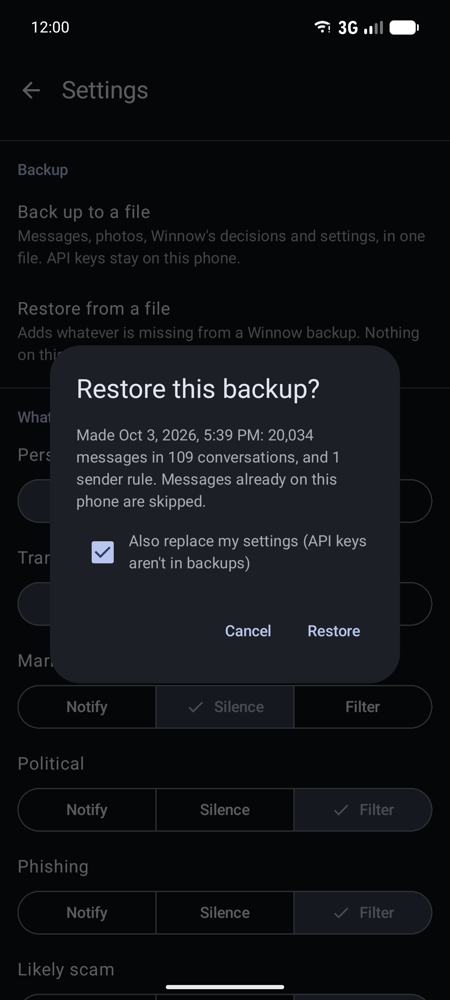</td>
  </tr>
  <tr>
    <td align="center"><sub>Back up and restore</sub></td>
  </tr>
</table>

The UI follows Google Messages: a large-title inbox on a rounded sheet, an avatar menu,
timestamped conversation blocks, Material You colors and dark mode.

## Privacy

What a classifier service sees is deliberately small. Settings → **Try it** shows the exact
payload for any message.

- Texts from saved contacts, from people you've texted, and verification codes are decided
  on the phone and never sent anywhere.
- Runs of 4+ digits become `####`, email addresses become `[email]`, and links are sent as
  their domain only.
- The sender's number isn't shared unless you turn that on.
- **Zero-retention only** mode skips any provider you haven't marked as keeping no data.
- API keys are encrypted with the Android Keystore.
- **On this phone only** keeps everything local. Winnow's own model (below) decides, and
  it only filters when it's at least 85% sure; otherwise it silences.
- **Decide on this phone when it's sure** keeps texts the model is very sure about (95%+)
  from ever reaching your provider. In cross-validation that's two-thirds of texts, and 98.5%
  of those calls are right.
- If no provider answers in time, the on-phone model decides. If classification fails
  altogether, the message is delivered with a notification.

## Classification is provider-agnostic

```
incoming text → local rules (contacts, codes, sender rules)
              → on-phone model, if you let it decide when it's sure
              → privacy gate + redaction
              → DecisionProvider: Jev (TypeSafe / OpenRouter) · any System One server
                                  · any OpenAI-compatible LLM
              → on-phone model if nothing answers
```

The app only depends on `DecisionProvider`: a state plus typed multiple-choice questions,
answered with probabilities. Jev speaks that shape natively. Anything else can implement it.
Details, including how to add a provider: [docs/ARCHITECTURE.md](docs/ARCHITECTURE.md).

### The on-phone model

Winnow ships its own classifier: a softmax regression over words, word pairs and signals
for what words miss. Those signals include a link to an unusual domain, a web address dressed
up as another ("sunpass.com-tollpay.vip"), a stranger introducing themselves "with" a group,
a donation "match", a deadline, a "reply STOP" opt-out, and letters from another alphabet
posing as English. The weights are 230 KB. It classifies a text in about 50 µs on a laptop
JVM (not yet measured on a phone), and it says why it decided ("Decided on this phone:
“confirm”, “package”, “fee”"). It's trained from 1,125 labeled texts in
`classifier/training/`, balanced across all seven categories.
`./gradlew :classifier:trainLocalModel` rebuilds it, and a test fails if the shipped model or
its metrics don't match the corpus.

A provider like Jev is still the better judge. The model's job is to keep the phone useful
without one.

## How accurate it is

**Filtered → How accurate is this?** opens the full report card, measured with 5-fold
cross-validation: every text is scored by a model that never saw it.

| Accuracy | Macro F1 | Cohen's κ | MCC | ROC AUC (unwanted vs. wanted) | Avg. precision | Calibration error |
|---|---|---|---|---|---|---|
| 92.1% | 0.92 | 0.91 | 0.91 | 0.988 | 0.988 | 0.026 |

Winnow's own filtering rule (an unwanted category at ≥85% confidence) catches 77% of
unwanted texts and filters 1.2% of wanted ones. The less certain rest is silenced, not
filtered. Per category, F1 runs from 0.96 (transactional, marketing, political) to 0.78 for
"likely scam", whose "hi, is this David?" openers read exactly like a real new number. On
120 more texts written separately and never trained on, it got all 120 right.

<table>
  <tr>
    <td>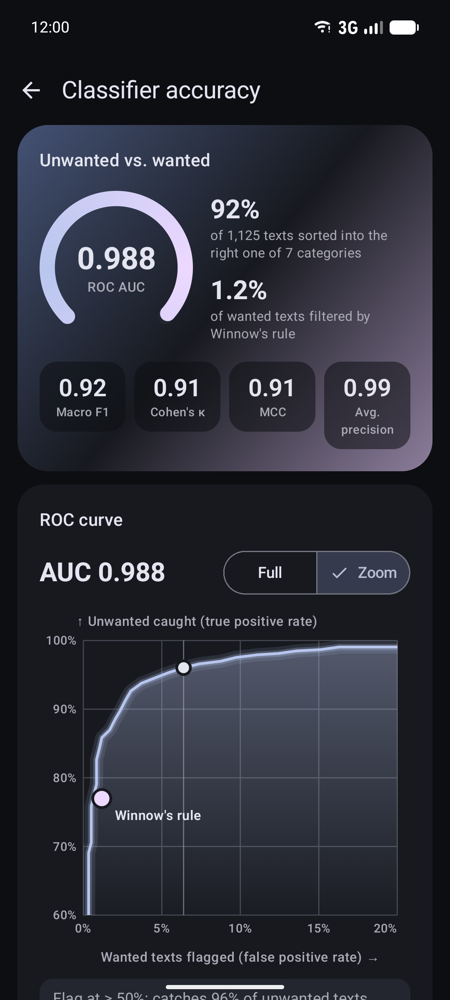</td>
    <td>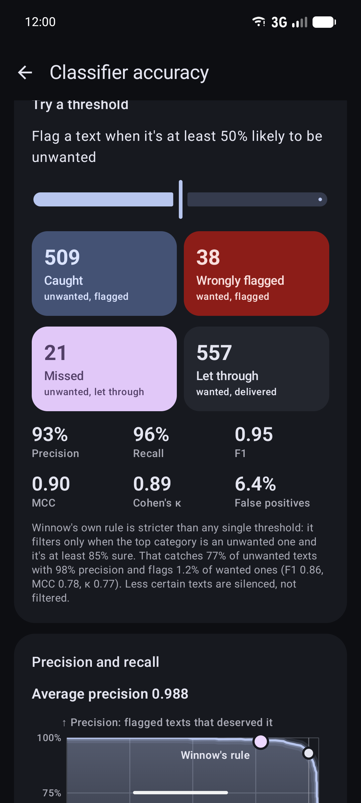</td>
    <td>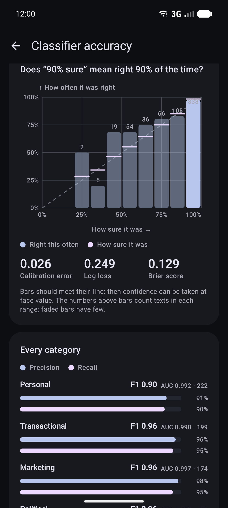</td>
    <td>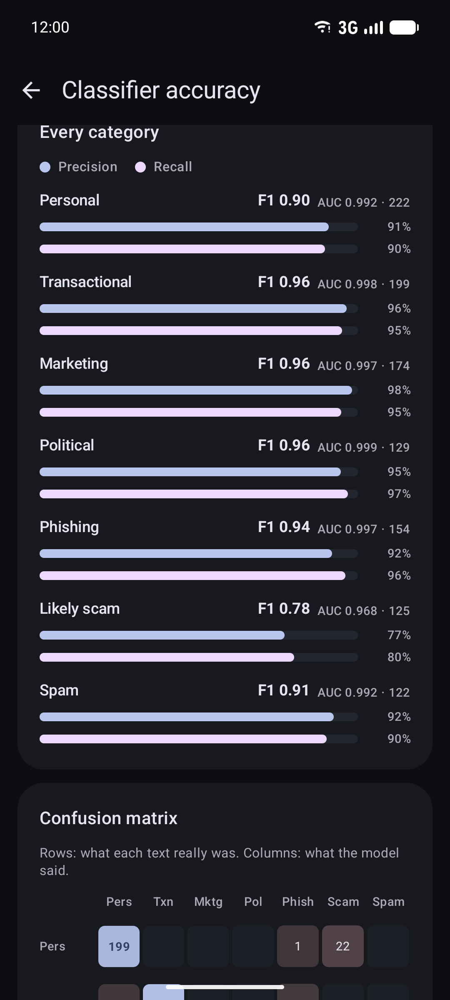</td>
    <td>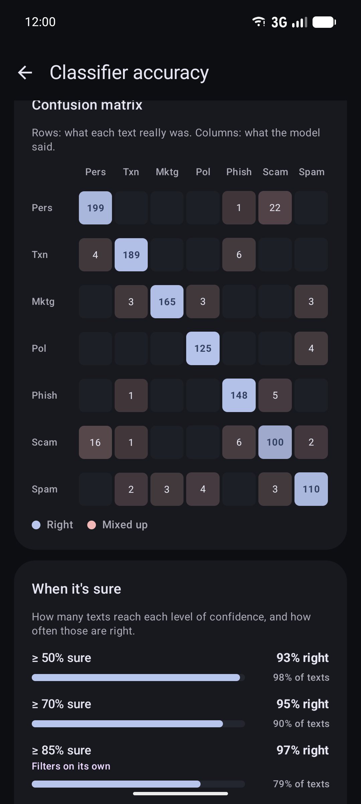</td>
  </tr>
  <tr>
    <td align="center"><sub>ROC AUC, κ, MCC, F1; the ROC curve (scrub it)</sub></td>
    <td align="center"><sub>Pick a threshold, see the outcomes</sub></td>
    <td align="center"><sub>Calibration: is “90% sure” right 90% of the time?</sub></td>
    <td align="center"><sub>Every category: precision, recall, F1, AUC</sub></td>
    <td align="center"><sub>Confusion matrix and coverage</sub></td>
  </tr>
</table>

The ROC and precision–recall curves follow your finger, and both move with the threshold
slider, which redraws caught, missed, wrongly flagged and let through, plus precision,
recall, F1, MCC and κ. The report also covers calibration (does "90% sure" mean right 90% of
the time?), each category's precision, recall, F1 and one-vs-rest AUC, the confusion matrix,
and how often you've corrected Winnow on your own texts. The same numbers are in
[classifier/training/REPORT.md](classifier/training/REPORT.md).

The test texts are hand-written to show their category clearly, so real traffic will score
lower. These figures are for the on-phone model. A classifier service like Jev shows up in
the "On your phone" agreement score, which comes from your corrections.

It also **learns from your corrections**. "Not spam" or "Filter sender" teaches it about
that message's content, so similar texts from other senders follow; a sender rule only
covers the one sender. Only hashed word fingerprints are kept, never the message, and
Settings → **Forget** undoes all of it.

## RCS

Android has no public RCS API: only Google Messages can use it. As your default SMS app,
Winnow sends and receives **SMS and MMS**. Group chats and photos work, but typing
indicators, read receipts and end-to-end encryption don't. Message transport sits behind
one interface, so RCS can be added if Google ever opens it. You can switch back to Google
Messages at any time.

## Build and run

You need JDK 17+ (21 recommended) and an Android SDK with API 37. The minimum supported
version is Android 12 (API 31).

```sh
export JAVA_HOME=~/.local/opt/jdk-21          # wherever your JDK lives
echo "sdk.dir=$HOME/Android/Sdk" > local.properties
./gradlew :classifier:test :mms:test :app:testDebugUnitTest   # JVM unit tests
./gradlew :app:assembleDebug                   # app/build/outputs/apk/debug/app-debug.apk
adb install -r app/build/outputs/apk/debug/app-debug.apk
```

Open Winnow, follow onboarding, and pick a classifier. Until a provider is configured,
Winnow runs on the phone only.

### Trying it on an emulator

```sh
scripts/emulator-smoke.sh
```

The smoke script installs the app, takes the SMS role, and feeds it sample traffic: SMS
through the emulator's virtual modem, a tapback, a group MMS with a photo, and an MMS whose
download fails. It refuses to run unless exactly one device is attached and that device is
an emulator. Every number is fictional and nothing leaves the machine.

You can also do it by hand. `adb emu sms send 4155550123 "hello"` delivers an SMS. Debug
builds accept fake MMS through the real receive path, since emulators have no MMS server:

```sh
adb shell am broadcast -n com.ericflo.winnow/.debug.DebugMmsReceiver \
    --es from +14155550181 --es to "+15551234567,+14155550182" --es text "hi" --ez photo true
```

`DebugSeedReceiver` writes thousands of synthetic messages, for testing at scale.

### Live classifier test (opt-in)

This runs the real pipeline against Jev and needs your own key. It never runs in CI.

```sh
WINNOW_LIVE_TESTS=1 ./gradlew :classifier:test --tests '*LiveProviderTest*' --rerun
```

It uses `OPENROUTER_API_KEY` and/or `TYPESAFE_API_KEY`.

## Project layout

```
classifier/   Pure Kotlin/JVM: decision interface, providers, taxonomy, privacy, redaction, tests.
mms/          Pure Kotlin/JVM: MMS PDU encoder/decoder (OMA-MMS-ENC over WSP), tests.
app/          The Android app: Compose + Material 3; Room for verdicts, conversation state and
              scheduled sends; DataStore for settings; the system SMS/MMS store for messages.
docs/         Architecture notes and screenshots.
scripts/      Emulator smoke test.
```

## Status

Developed and verified on the Android emulator, and not yet run on a phone. Not built yet:
RCS (see above), an on-device model, multi-SIM choice when sending.
