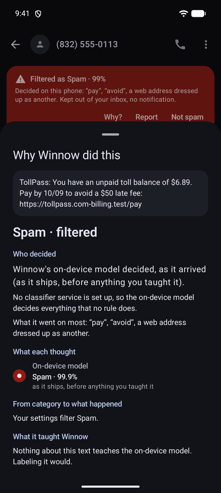
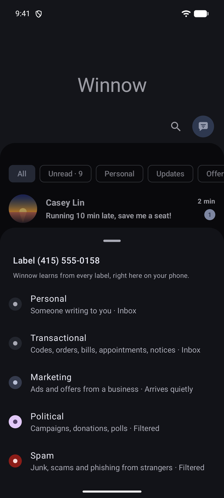
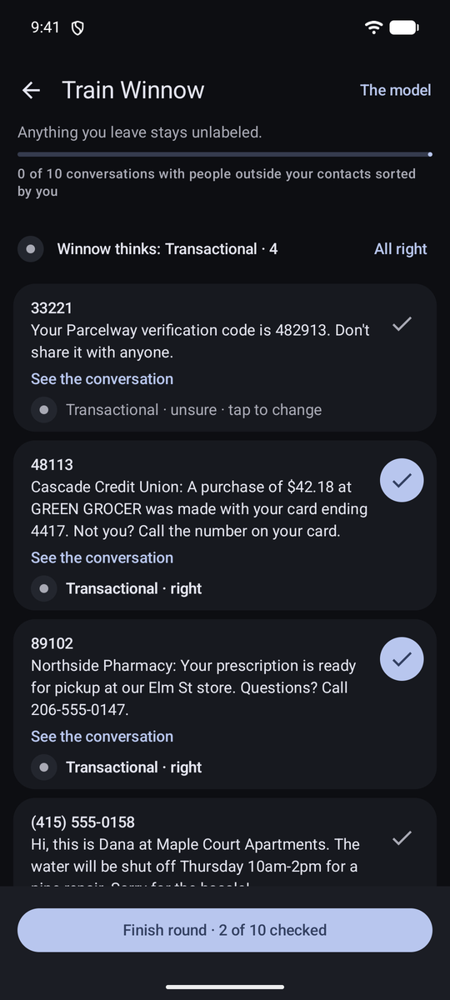
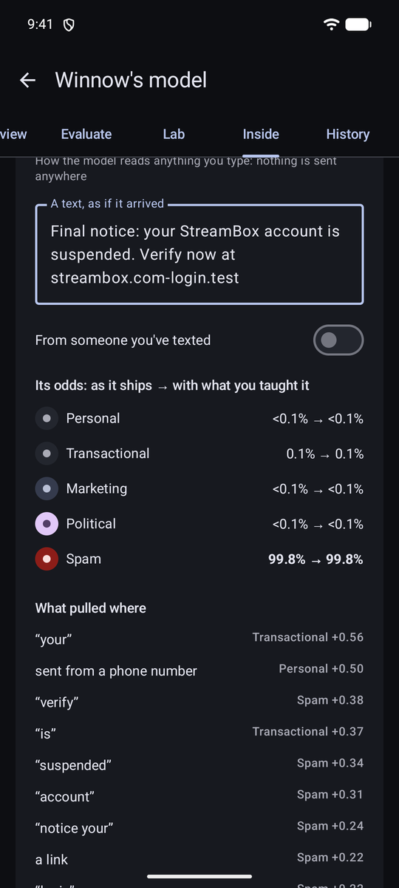

# Winnow

**An Android SMS/MMS app that reads every incoming text before it can buzz your phone.**

People you know come through. Spam, scams, phishing and political blasts go to Filtered, with
no notification. Marketing arrives quietly. Nothing is deleted, every decision says why, and one
tap fixes a wrong call.

<table>
  <tr>
    <td></td>
    <td></td>
    <td></td>
    <td></td>
  </tr>
  <tr>
    <td align="center"><sub>Inbox: marketing arrives quietly</sub></td>
    <td align="center"><sub>Filtered: spam and political</sub></td>
    <td align="center"><sub>Filtered on the phone, links off</sub></td>
    <td align="center"><sub>Who decided, and why</sub></td>
  </tr>
  <tr>
    <td></td>
    <td></td>
    <td></td>
    <td></td>
  </tr>
  <tr>
    <td align="center"><sub>Label anything, one tap</sub></td>
    <td align="center"><sub>Train it in rounds</sub></td>
    <td align="center"><sub>See how the model reads any text</sub></td>
    <td align="center"><sub>A complete SMS/MMS app</sub></td>
  </tr>
</table>

<sub>Screenshots are from an emulator with made-up conversations: every name, number and link is
fictional. A fresh install is empty until Winnow is your SMS app.</sub>

## Why

Google Messages lets too much through. Winnow replaces it as your default SMS app, so it sees
each text first and decides whether it deserves your attention. The decision comes from a
pluggable classifier: Winnow's own model on the phone, or a service such as Jev by TypeSafe,
your own server, or any OpenAI-compatible model.

## Features

**Filtering**
- Five categories, each with an action you choose: **personal** and **transactional** notify,
  **marketing** arrives silently, **political** and **spam** go to Filtered.
- A banner on every filtered conversation says what decided it and why, with **Not spam**,
  **Filter sender** and **Report** (to your carrier's 7726 spam service). Links in spam can't be tapped.
- Contacts, people you've texted and verification codes are always decided on the phone.
- Filtered words, sender rules, an optional daily summary, and optional clean-up of old filtered texts.

**Teaching it your texts**
- **Label** any conversation or message (swipe left, or long-press). The on-phone model refits
  immediately; Undo takes it back.
- **Train Winnow** works through your backlog in rounds of 20, starting where the model is least sure.
- Optionally let a classifier service label your backlog first (zero-retention only, after a
  confirmation that says exactly what leaves the phone; about $0.0001 a text with Jev).
- Your labels of a sender follow that sender: three labeled one way decide their next texts
  (unless you text with them; people send every kind).
- **Winnow's model** shows everything: how it does on your own labels (cross-validated), who
  decided each text, what your teaching changed, and how it reads anything you type. Its **Lab**
  designs, trains, sweeps and compares models on the phone.

**Messaging**
- SMS and MMS, group conversations, photos, video, voice messages, GIFs, reactions (sent as
  iPhone-style tapbacks), contact cards, and link previews (opt-in, never for strangers).
- Scheduled send, undo send, drafts, quick replies, suggested replies, Remind me, starred
  messages, full-text search, pin, archive, mute, and Recently deleted (30 days).
- Conversation notifications with inline reply, chat bubbles, Android Auto, dual SIM, a home-screen
  widget, a two-pane layout on tablets and foldables, and light and dark themes.
- Backups to a zip you keep (weekly automatic, password-protected optional), plus import from
  and export to SMS Backup & Restore.

The full tour is in [docs/FEATURES.md](docs/FEATURES.md).

## Privacy

- **On this phone only** keeps everything local: Winnow's model decides, and filters only when it's at least 85% sure.
- With a service set up, texts from contacts, people you've texted and verification codes still
  never leave the phone, and you can keep texts the model is very sure about local too.
- What a service sees is redacted: digit runs become `####`, emails `[email]`, links their domain.
  The sender's number isn't shared unless you turn that on. Settings → **Try it** shows the exact payload.
- API keys are encrypted with the Android Keystore. App lock, and hiding texts on the lock screen, are optional.
- Labels are kept as hashed word fingerprints, never the text, and stay on the phone.

## How it decides

```
incoming text → rules on the phone (contacts, codes, sender rules, filtered words)
              → on-phone model, if your labels of the sender decide it, or it's sure enough
              → privacy gate + redaction
              → DecisionProvider: Jev (TypeSafe / OpenRouter) · any System One server · any OpenAI-compatible LLM
              → on-phone model if nothing answers
```

The app depends only on `DecisionProvider`, a small interface for typed multiple-choice questions
answered with probabilities, so any service can be plugged in. See
[docs/ARCHITECTURE.md](docs/ARCHITECTURE.md).

The on-phone model is a softmax regression over words, word pairs and signals such as a web
address dressed up as another ("sunpass.com-tollpay.vip"), money, deadlines and opt-outs. It's
about 160 KB, classifies a text in about 50 µs on a laptop, and is trained from 1,493 hand-written texts in
[`classifier/training/`](classifier/training/). On those (5-fold cross-validated):

| Accuracy | Macro F1 | ROC AUC, unwanted vs. wanted | Wanted texts filtered | Unwanted kept quiet | Held-out set |
|---|---|---|---|---|---|
| 92.0% | 0.92 | 0.985 | 0.4% | 92.5% | 98.5% of 135 |

Hand-written texts are cleaner than real traffic, so treat these as an upper bound. In the app,
**Filtered → How accurate is Winnow?** scores it on your own labels. Full numbers:
[classifier/training/REPORT.md](classifier/training/REPORT.md).

## Install

1. In Google Messages, turn off RCS (Settings → RCS chats). Android only lets Google Messages use
   RCS, so Winnow works over SMS and MMS: groups and photos work, but typing indicators, read
   receipts and RCS encryption don't.
2. Download `winnow-X.Y.Z.apk` from the [latest release](https://github.com/ericflo/winnow/releases) and open it.
3. Open Winnow and tap **Set as default SMS app**. On Android 15+, a browser-installed app is
   refused the first time: open App info (Winnow links to it), tap ⋮ → **Allow restricted
   settings**, then try again.

Android 12 (API 31) or later. You can switch back to Google Messages any time.

## Build

JDK 17+ (21 recommended) and an Android SDK with API 37:

```sh
echo "sdk.dir=$HOME/Android/Sdk" > local.properties
./gradlew :classifier:test :mms:test :app:testDebugUnitTest :app:lintDebug :app:assembleDebug
adb install -r app/build/outputs/apk/debug/app-debug.apk
```

`scripts/emulator-smoke.sh` installs it on an emulator and feeds it sample traffic (fictional
numbers only). Emulator recipes, the opt-in live classifier test, CI and releases:
[docs/DEVELOPMENT.md](docs/DEVELOPMENT.md).

```
classifier/  Pure Kotlin/JVM: decision interface, providers, taxonomy, privacy, on-phone model
mms/         Pure Kotlin/JVM: MMS PDU encoder/decoder
app/         The Android app: Compose + Material 3, Room, DataStore, the system SMS/MMS store
```

## Status

In daily use on the author's phone. Known issue: picture-message downloads fail on at least one
carrier, and Winnow now says why each one failed while that's tracked down. RCS isn't possible
(see Install).

## License

[MIT](LICENSE)
